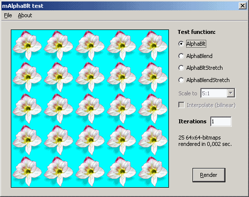



## Stretching alpha\-bitmaps

### Description

Some additions: AlphaBltStrecth and AlphaBlendStretch with and without interpolation (bilinear). Thanks to Ron van Tilburg for the fast 'integer maths' version of Peter Scale's 'Bilinear resizing' routine. And about this, a note: API AlphaBlend stretches using nearest-neighbour method (it only allows COLORONCOLOR for SetStretchBltMode function). This has a simple explanation: interpolation of alpha-bitmaps involves "pre-blending" (composition) alpha-pixels before rendering onto given DC. This complicates processing. This is supposed what GDI+ solves. Attached, there is a GDI+ test project for comparison purposes (compare flower contour-pixels of both tests; increase iterations for better appreciation and use AlphaBlendStretch function). 

----

Update #1. Some effects; packed in mDIB32Ext module: 'ConvertToGrey', 'BlendWithColor' and 'ChangeGlobalAlpha'. You can add your own ones. Remember pixel data is stored as ARGB (BGRA byte array).
 
### More Info
 

             |
---                |---
**Submitted On**   |2005-05-14 00:00:52
**By**             |[Carles P\.V\.](https://github.com/Planet-Source-Code/PSCIndex/blob/master/ByAuthor/carles-p-v.md)
**Level**          |Intermediate
**User Rating**    |5.0 (140 globes from 28 users)
**Compatibility**  |VB 6\.0
**Category**       |[Graphics](https://github.com/Planet-Source-Code/PSCIndex/blob/master/ByCategory/graphics__1-46.md)
**World**          |[Visual Basic](https://github.com/Planet-Source-Code/PSCIndex/blob/master/ByWorld/visual-basic.md)
**Archive File**   |[Stretching1888045132005\.zip](https://github.com/Planet-Source-Code/carles-p-v-stretching-alpha-bitmaps__1-60424/archive/master.zip)

